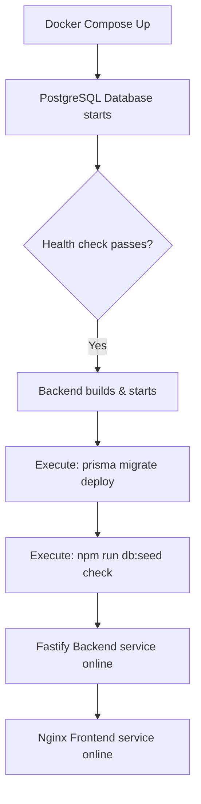

# Production Deployment Guide

This document describes the deployment architecture, configuration steps, database migration guidelines, and rollback workflows required to host PayFlow in a production environment.

---

## Overview

This guide assumes target hosting on standard Linux Virtual Machines (e.g. AWS EC2, DigitalOcean Droplets) using Docker Engine to manage service lifecycles. 

---

## Deploy to a Linux VM

Follow these steps to deploy PayFlow on a fresh Ubuntu server:

1. **Install Docker Engine & Docker Compose**:
   ```bash
   sudo apt-get update
   sudo apt-get install -y docker.io docker-compose-v2
   sudo systemctl enable --now docker
   ```

2. **Clone the repository**:
   ```bash
   git clone https://github.com/akash768145s/payflow-expense-approval.git
   cd payflow-expense-approval
   ```

3. **Configure environment variables**:
   Create a production `.env` file:
   ```bash
   cp .env.example .env
   nano .env # Edit secrets and variables
   ```

4. **Build and start the application**:
   ```bash
   docker compose up --build -d
   ```

---

## Deployment Flow

When running `docker compose up --build -d`, the services coordinate startup sequence automatically:



1. **PostgreSQL Container (`payflow-db`)**: Launches and awaits local connections.
2. **Database Health Check**: Confirms standard database sockets are ready.
3. **Database Migrations (`prisma migrate deploy`)**: Applies outstanding schema modifications without deleting data.
4. **Database Seeding**: Seeding scripts verify if the DB is empty. If it has no records, seed data (demo organizations and accounts) is inserted.
5. **Backend Launch**: Fastify binds to the port and starts listening for HTTP queries.
6. **Frontend Container (`payflow-frontend`)**: The React SPA is bundled and served through Nginx.

---

## Updating to a New Version

To deploy code updates safely:

1. **Fetch the latest codebase changes**:
   ```bash
   git pull origin main
   ```

2. **Rebuild the images**:
   ```bash
   docker compose build
   ```

3. **Re-launch updated containers**:
   ```bash
   docker compose up -d
   ```

---

## Safe Database Migration Strategy

### The Rule
> [!IMPORTANT]
> **Never execute manual SQL commands on the production database.** All modifications must be generated via Prisma and tracked in git.

* **Migrations Deployment**: Use `npx prisma migrate deploy` in the deployment pipeline. This ensures only pending migration files under `/prisma/migrations` are executed.
* **Backward Compatibility**: Migrations must be backward-compatible (e.g. only add columns or tables) so old running versions of the application continue working during updates. Destructive migrations (like dropping columns) should be split into a later step after code changes are deployed.

---

## Rollback Strategy

In case of critical failures:

* **Application Rollback**:
  * Revert git commit to the last stable release tag: `git checkout tags/v1.0.x`.
  * Rebuild and re-deploy images: `docker compose build && docker compose up -d`.
* **Database Rollback**:
  * If a migration fails, write a compensating migration script that reverses the changes.
  * If Prisma gets out of sync, mark the failed migration as rolled-back manually:
    ```bash
    npx prisma migrate resolve --rolled-back "20260628000000_failed_migration"
    ```
  * **Pre-Migration Backups**: Take a snapshot or run `pg_dump` immediately before deploying any database schema updates.

---

## Process Management

PayFlow containers use restart policies (`restart: unless-stopped` in `docker-compose.yml`). If a container crashes (e.g. out of memory, unexpected database disconnect) or the underlying host server restarts, the Docker daemon automatically brings all services back online.

---

## Zero-Downtime Deployment

To scale past single-server deployments and eliminate downtime during updates, the infrastructure should evolve to include:
* **Load Balancer**: A gateway (like AWS ALB or Nginx reverse proxy) that handles client connections.
* **Blue-Green Deployments**: Spin up a complete copy of the application (Green) with the new code while the current version (Blue) serves traffic.
* **Health Checks**: Route traffic to Green only after its container health check returns `200 OK`.
* **Rolling Updates**: Gracefully drain connections from the Blue containers before decommissioning them.

---

## Environment Variables

| Variable | Description | Example / Default |
| --- | --- | --- |
| `DATABASE_URL` | PostgreSQL connection string | `postgresql://postgres:hello@db:5432/payflow` |
| `PORT` | Local port the backend service binds to | `3000` |
| `COOKIE_SECRET` | Cryptographic secret for signing session cookies | `super-secret-cookie-signing-key` |
| `NODE_ENV` | Mode setting for express/fastify features | `production` or `development` |

---

## Monitoring

* **Health Check Endpoint**: Periodically probe `GET /health` to monitor service uptime.
* **Docker Logs**: Inspect service logs in real time:
  ```bash
  docker compose logs -f payflow-backend
  ```
* **GitHub Actions**: Monitor automated CI builds and check for failing test logs.

---

## Troubleshooting

### 1. Database Not Starting
* **Symptom**: `payflow-db` exits immediately on launch.
* **Fix**: Check host port conflict (another service on port 5432). Verify storage space availability on the host volume.

### 2. Backend Unhealthy
* **Symptom**: Uptime checks fail on `/health`.
* **Fix**: Confirm the `DATABASE_URL` is set correctly and the database container is online. Run `docker compose logs payflow-backend` to view stack traces.

### 3. Frontend Unavailable
* **Symptom**: Browsing `http://localhost:8080` returns connection refused.
* **Fix**: Ensure port 8080 is not blocked by a host firewall. Verify the frontend Nginx reverse proxy container status.

### 4. Migration Failures
* **Symptom**: Database schema changes fail during deployment.
* **Fix**: Verify manual changes have not caused schema drift. Run `npx prisma db pull` to compare and use `prisma migrate resolve` to mark failed steps.

---

## Backup Strategy

Automate database backups using a cron job that exports database snapshots:
```bash
pg_dump -U postgres -h 127.0.0.1 payflow > /backups/payflow_$(date +%F).sql
```
Upload backup files to a secure, remote destination (like AWS S3) and rotate them with a 30-day retention policy.

---

## Security Considerations

* **Secrets Management**: Do not commit the `.env` file to version control. Use a secret manager (like AWS Secret Manager, Vault) to inject variables at runtime.
* **Cookie Protection**: Keep cookies signed and secure. For production environments, configure cookies with `Secure; SameSite=Strict` to prevent CSRF.
* **HTTPS**: Force all connections over HTTPS. SSL termination should be handled by a proxy (like Nginx, Cloudflare, or an ALB) before traffic reaches the backend.
